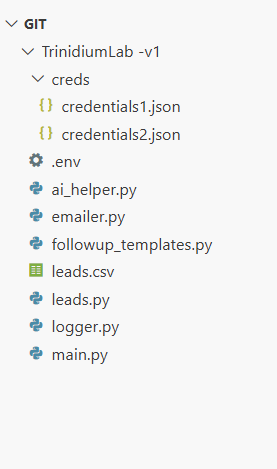

# TrinidiumLab-v1
Built with Python and Open Source APIs to streamline lead Emailing from a CSV

Welcome to the first public release from the labs of **TrinidiumLab** — a free, open-source tool that helps automate your prospecting process using simple scripts and structured data.

> “The future belongs to those who systemize today.” – Trinidium

---

## 🔍 What It Does

This version includes tools that allow you to:

- 📤 Load `.csv` files with business names, emails
- 🔐 Use `.env.example` to manage sensitive keys or inputs for custom APIs/scripts
- 🔑 Load `credentials.json` to authenticate and send Emails via Gmail
- 🧾 Log SENT or ERROR Emails to respective Files `sent_emails.txt, error_emails.txt`

Perfect for agency owners, cold outreach pros, or anyone building their list manually — now with a sprinkle of code.

---

## 🧪 What's Inside

- `main.py` – Starter script to run the tool    
- `example.csv` – Sample input format to understand data structure  
- `.env.example` – Template for your secure API keys/config
- Other various `.py` files but important

## 📁 Project Folder Structure (Visual)

This is how your folder should look before running the tool:

